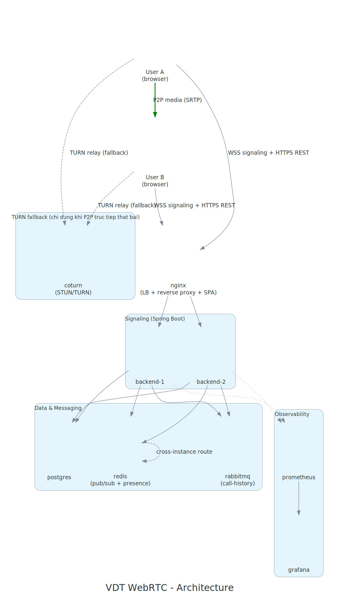
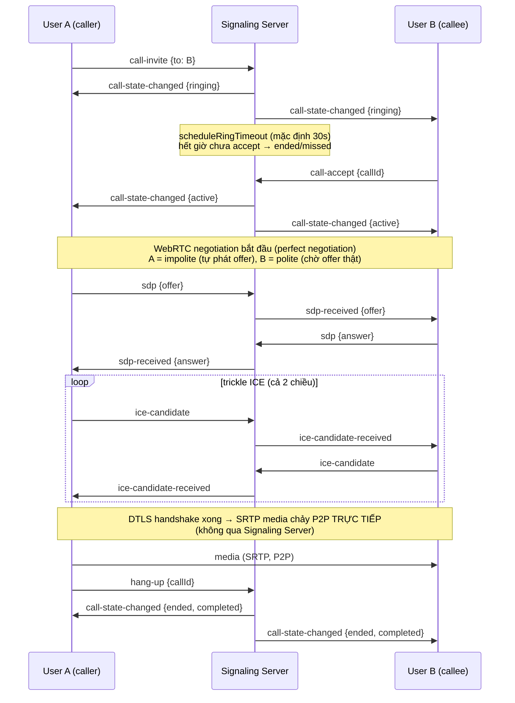
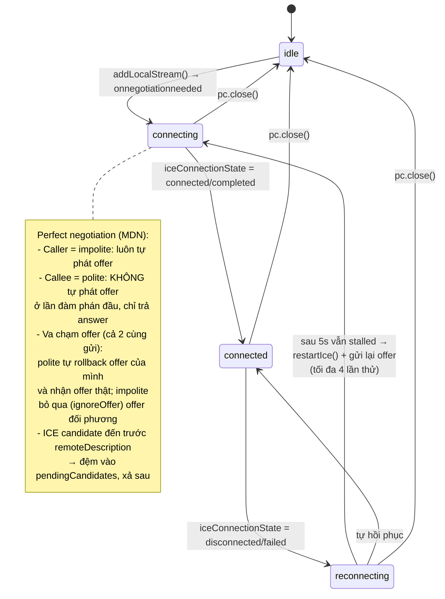
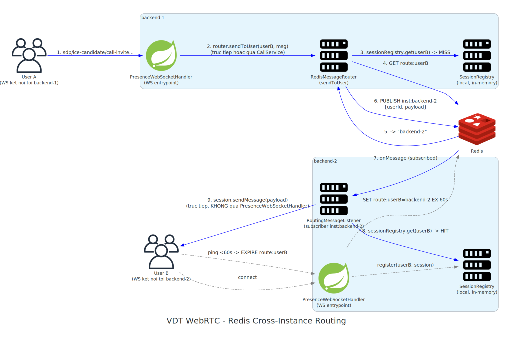
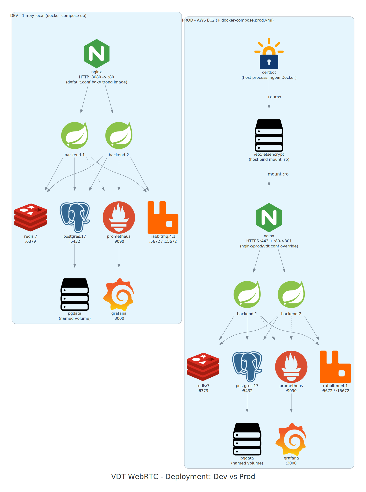

# Architecture — VDT WebRTC

Sơ đồ kiến trúc hệ thống, ở 4 góc nhìn khác nhau: tổng quan hạ tầng, luồng nghiệp vụ 1 cuộc gọi, vòng đời kết nối WebRTC phía client, và chi tiết cơ chế định tuyến cross-instance qua Redis.

## 1. Tổng quan hạ tầng

<p align="center">
  <a href="vdt_webrtc_architecture.svg"></a>
  <br><sub>Bấm vào ảnh để xem bản full-size (.svg)</sub>
</p>

Client gọi P2P trực tiếp cho nhau (media không qua server, trừ khi phải fallback qua TURN). Server chỉ làm signaling: nginx cân bằng tải giữa 2 instance backend Spring Boot, Redis lo presence + định tuyến message giữa 2 instance, RabbitMQ ghi lịch sử cuộc gọi bất đồng bộ, Prometheus/Grafana theo dõi cả 2 instance riêng biệt.

## 2. Luồng signaling 1 cuộc gọi

Đúng protocol thật đã xác nhận ở [spike 001](../spikes/001-k6-ws-baseline/README.md) — nguồn: `CallService.java`, `ClientMessage`/`ServerMessage`, `PeerManager.ts`.



**Lưu ý vận hành quan trọng** (phát hiện ở spike 001): client phải gửi `{"type":"ping"}` định kỳ dưới 60s trong suốt phiên WS — không riêng lúc gọi — để giữ route Redis sống. Thiếu ping, mọi message ở trên có thể bị drop âm thầm, không có lỗi trả về phía gửi.

## 3. Vòng đời kết nối WebRTC phía client (perfect negotiation)

Nguồn: `frontend/src/webrtc/PeerManager.ts` (`mapIceState`, `handleNegotiationNeeded`, `scheduleRecoveryIfNeeded`).



## 4. Redis cross-instance routing (chi tiết)

<p align="center">
  <a href="redis_routing.svg"></a>
  <br><sub>Bấm vào ảnh để xem bản full-size (.svg)</sub>
</p>

Zoom vào đúng phần được đánh giá là "con số/kiến trúc giá trị nhất" trong [spike MANIFEST](../spikes/MANIFEST.md) — nguồn: `RedisMessageRouter.java`, `RoutingMessageListener.java`, `PresenceWebSocketHandler.java`.

Mỗi instance chỉ giữ session WebSocket **local** trong `SessionRegistry` (in-memory). `PresenceWebSocketHandler` là entrypoint WS (connect/ping/disconnect, `SET route:<username>=<instanceId> EX 60s` lúc connect, refresh TTL mỗi lần nhận `ping`). Khi cần gửi message tới 1 user, `RedisMessageRouter.sendToUser()` tra `SessionRegistry` cục bộ trước; nếu **miss** (user không có session trên instance này), tra tiếp `route:<username>` trên Redis rồi `PUBLISH` message lên kênh `inst:<instanceId>` của instance đích. **Phía nhận không đi qua `PresenceWebSocketHandler`** — `RoutingMessageListener` subscribe kênh, lấy thẳng `WebSocketSession` từ `SessionRegistry` và gọi `session.sendMessage()` trực tiếp.

## 5. Deployment: dev vs prod

<p align="center">
  <a href="deployment.svg"></a>
  <br><sub>Bấm vào ảnh để xem bản full-size (.svg)</sub>
</p>

Nguồn: `docker-compose.yml` (base, dùng chung) + `docker-compose.prod.yml` (override). Khác biệt duy nhất giữa 2 môi trường nằm ở nginx: dev phục vụ HTTP thẳng trên `:8080` (config bake sẵn trong image), prod đè bằng `nginx/prod/vdt.conf` — TLS trên `:443`, redirect `:80 → :443`, mount cert Let's Encrypt (`certbot` chạy standalone trên host EC2, ngoài Docker) theo chế độ read-only. Toàn bộ service còn lại (2 backend, postgres, redis, rabbitmq, prometheus, grafana) giữ nguyên giữa 2 môi trường.

```bash
# Prod chạy kèm override, không sửa gì ở docker-compose.yml:
docker compose --env-file .env.prod -f docker-compose.yml -f docker-compose.prod.yml up -d --build
```

## Cách regenerate diagram

Script Python dùng thư viện [`diagrams`](https://github.com/mingrammer/diagrams) (mingrammer), cần cài `pip install diagrams` + binary [Graphviz](https://graphviz.org/download/) (`dot`) có trong `PATH`.

```bash
# Windows: nếu vừa cài Graphviz qua winget, PATH có thể chưa refresh trong terminal hiện tại
PATH="/c/Program Files/Graphviz/bin:$PATH" python docs/architecture/system_diagram.py
PATH="/c/Program Files/Graphviz/bin:$PATH" python docs/architecture/redis_routing.py
PATH="/c/Program Files/Graphviz/bin:$PATH" python docs/architecture/deployment.py
```

Mỗi script xuất cả `.png` (xem nhanh) và `.svg` (nét ở mọi độ zoom, dùng trong README này vì GitHub render SVG trực tiếp). Sơ đồ luồng gọi (mục 2) và vòng đời kết nối (mục 3) là Mermaid nhúng thẳng trong markdown — không cần generate file, GitHub render native, sửa trực tiếp trong file `.md` này.
